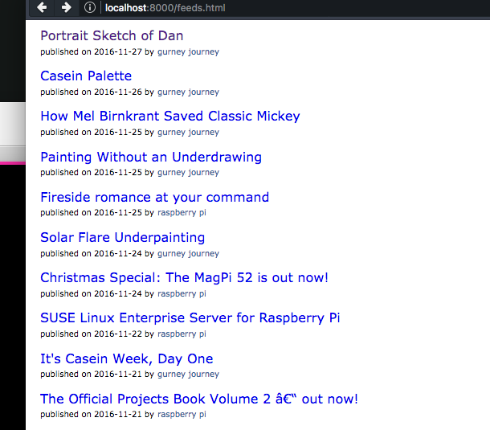

# Feed List

Simple python script that uses the _feedparser_ library to pull a list of RSS
feeds, sort their items by date, and generate a simple HTML file.

Open up the script and edit the few global vars as you desire.

Tested with python 3.5 and feedparser 5.2.1

